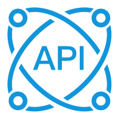

<p align="center"></p>
<h1 align="center">API接口平台</h1>
<p align="center">API接口平台主页接口调用网站源码</p>

## 介绍说明

> [https://www.liitk.com/](https://www.liitk.com/)

此项目是利熙整改合并的API平台源码（内含数十项接口），大部分内容来源于网络，已有的API接口都是可以正常使用。（放在这里就是用作备份，喜欢的也可以下载使用。）

+ 运行环境 PHP
+ PHP版本 5.6+ 
+ Nginx伪静态(利用NGINX重定向规则 把PHP后缀屏蔽掉)
```bash
location / {
try_files $uri $uri/ $uri.php?$args;
}
```
+ 无后台管理
+ 整站自适应
+ 独立信息文件
```bash
在 /i/website.php 修改整站信息、顶部底部信息。
```
> 主页的句子在 /js/page.js 里修改
+ 附3款API空白文档
```bash
/i/api/blank-1.php
/i/api/blank-2.php
/i/api/blank-3.php
```

## 项目演示


## 其他

[QQ：1576384173](https://wpa.qq.com/msgrd?v=3&uin=1576384173)
